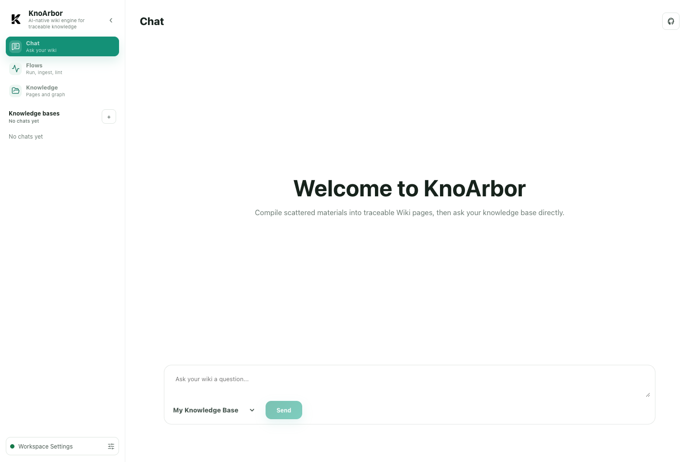

# KnoArbor

[English](README.md) | [简体中文](README.zh-CN.md)

<p align="center">
  
</p>

<p align="center">
  <a href="LICENSE"></a>
  
  
  <a href="docs/zh/QUICKSTART.md"></a>
</p>

KnoArbor 是一个本地优先的 AI 知识系统，把文档、对话和笔记编译成可追溯、
可维护并可持续查询的知识。

```text
本地资料 -> evidence units -> 知识索引 -> raw-grounded 回答
                              -> 可读 Markdown 投影
```

## 主要能力

- 导入 Markdown、支持的聊天历史和经过预处理的富文档；
- 保存不可变来源资料和带 evidence 的 source revision；
- 提取 entities、claims、relations 作为语义检索元数据；
- 为事实回答检索 raw evidence 与 source units；
- 维护可读 Markdown 投影和本地知识图谱；
- 通过桌面应用、CLI、本地 HTTP API 和宿主 AI Skill 访问同一 vault；
- 保存本地报告、台账、引用和恢复状态。

KnoArbor 面向个人用户在本地运行。文件操作和 vault 状态保留在本机；配置的
模型 API 是主要网络能力。

## 工作区

<p align="center">
  
</p>

桌面工作区提供 Chat、ingest 与维护流程、来源和报告检查、Wiki 浏览与图谱导航。
完整产品体验见[展示导览](docs/zh/SHOWCASE.md)。

## 安装

需要 Python 3.12+、[uv](https://docs.astral.sh/uv/) 和一个已配置的模型供应商。

```bash
git clone https://github.com/pxcg/KnoArbor.git
cd KnoArbor
uv sync
```

供应商、桌面端和文档处理设置见[安装部署](docs/zh/INSTALLATION.md)。

## 首次运行

```bash
uv run knoar first-run --vault ./vaults/default
uv run knoar doctor
uv run knoar ingest --connector markdown --write
uv run knoar serve
```

然后打开 `http://127.0.0.1:8000`。完整步骤见[快速开始](docs/zh/QUICKSTART.md)。

## 存储模型

- `raw/` 保存忠于来源的输入和确定性派生产物。
- `.knoarbor/facts/` 与 `.knoarbor/ingest.sqlite` 保存已发布事实状态。
- `wiki/pages/` 保存人工页面和确定性可读投影。
- `.knoarbor/index/` 保存可重建机器索引。
- `maintenance/reports/` 与 `.knoarbor/ledgers/` 保存审计材料。

Raw evidence 和 source units 是事实回答材料；Wiki 页面和 atom metadata 是
语义定位与可读投影。参见[核心概念](docs/zh/CONCEPTS.md)、
[架构设计](docs/zh/ARCHITECTURE.md)和[溯源设计](docs/zh/PROVENANCE_DESIGN.md)。

## 文档

- [文档中心](docs/zh/README.md)
- [展示导览](docs/zh/SHOWCASE.md)
- [快速开始](docs/zh/QUICKSTART.md)
- [配置说明](docs/zh/CONFIGURATION.md)
- [命令行](docs/zh/CLI.md)
- [接口说明](docs/zh/API.md)
- [故障排查](docs/zh/TROUBLESHOOTING.md)
- [备份与恢复](docs/zh/BACKUP_AND_RECOVERY.md)
- [契约总览](docs/zh/CONTRACTS.md)
- [开发说明](docs/zh/DEVELOPMENT.md)
- [变更记录](CHANGELOG.md)

## 开发

```bash
python scripts/plan-affected-validation.py
```

该规划器只列出可机械判断的门禁，并明确提示仍需工程判断的 focused tests。
发布候选使用 `scripts/release-check.sh`。详细流程由[开发说明](docs/zh/DEVELOPMENT.md)、
[测试与质量门禁](docs/zh/TESTING.md)和[发布清单](docs/zh/RELEASE_CHECKLIST.md)负责。

## 隐私与安全

运行时 vault、本地配置、模型凭据和生成报告可能包含隐私信息，默认不会进入
源码版本控制。不要提交 API Key 或个人 vault 内容。安全问题通过
[SECURITY.md](SECURITY.md)报告。

## 许可证

KnoArbor 使用 [Apache License 2.0](LICENSE)。归属与商标说明见
[NOTICE](NOTICE)和[THIRD_PARTY_NOTICES.md](THIRD_PARTY_NOTICES.md)。
