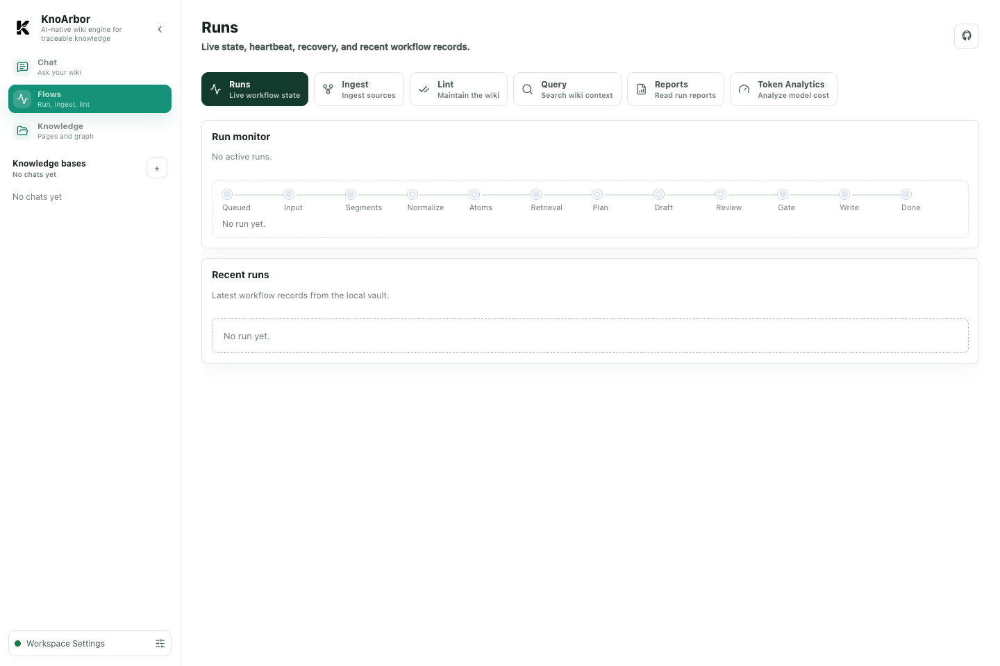
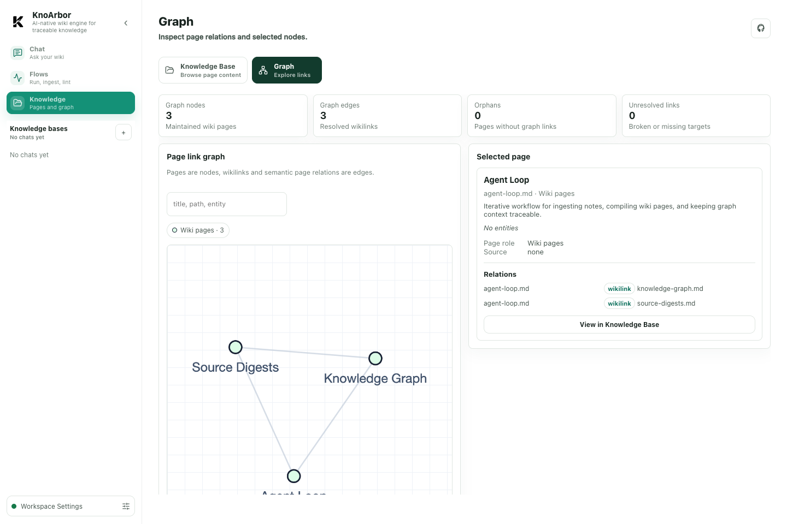

# Showcase

KnoArbor turns multi-source notes, AI sessions, and parsed documents into a local Markdown wiki that can be inspected, maintained, and queried by other AI tools.

It is designed as a knowledge engine, not a chat replacement:

```text
Sources -> Ingest -> Maintained wiki -> Lint -> Query context -> Host AI
```

## Product Snapshot

The desktop workspace is organized around three primary areas: Chat, Flows, and Knowledge.

### Chat


Ask the maintained wiki directly and keep local session history for later review or ingest.

### Flows



Run and monitor ingest, lint, query, report, and token-analysis workflows.

### Knowledge Graph



Inspect page-level wiki relationships without switching to an entity-relationship view.

## What It Builds

KnoArbor writes normal Markdown pages into a local vault:

- `wiki/pages/<slug>.md`: maintained knowledge pages. Open this directory in
  Obsidian when you only want the final wiki pages.
- `wiki/sources/<slug>.md`: source digest pages that explain what each source
  contributes.
- UI browsing views are derived from machine indexes rather than written as
  wiki pages.
- `raw/`: immutable copied or normalized source material.
- `maintenance/reports/`: human-readable run reports.
- `.knoarbor/`: machine state, indexes, ledgers, locks, and run records.

The result is a traceable knowledge network: knowledge pages are grounded by
source digests, source digests point back to raw sources, and query returns
evidence that a host AI can use.

## End-To-End Flow

### 1. Connect Sources

KnoArbor currently supports:

- Markdown notes.
- Codex JSONL sessions.
- Hermes sessions.
- OpenClaw sessions.
- Claude Code transcripts.
- Generic local chat JSONL or SQLite transcripts.
- Non-Markdown files through a user-configured MinerU-compatible preprocessor.

Connectors only normalize inputs into `SourceDocument`. They do not decide wiki page boundaries or write the wiki.

### 2. Ingest Knowledge

Ingest segments long sources, extracts stable knowledge, plans page operations, drafts pages, reviews them, writes approved pages, and records a report.

This keeps long chat logs and large documents from becoming one oversized page.

### 3. Maintain The Wiki

Lint scans structure, links, source provenance, graph health, and quality candidates. It can apply approved deterministic and semantic maintenance operations while preserving reports and verification results.

### 4. Query From Host AI Tools

Query returns ranked pages, excerpts, related context, source pointers, trace data, and a context pack for host AI tools. Wiki Chat can synthesize an evidence-backed answer inside KnoArbor when the user asks through the chat surface.

## Why This Is Different From Plain RAG

Plain RAG often retrieves raw chunks at answer time. KnoArbor compiles durable wiki pages before query time.

| Dimension | Plain RAG | KnoArbor |
| --- | --- | --- |
| Main artifact | Chunk index | Maintained Markdown wiki |
| Source handling | Search raw chunks | Preserve raw sources and source digests |
| Knowledge shape | Query-time snippets | Stable pages with claims, entities, relations, evidence, and links |
| Maintenance | Usually implicit | Explicit lint, reports, and verification |
| Human inspectability | Depends on app | Open `pages/` in an editor or Obsidian |

RAG can still be useful later as a retrieval backend. KnoArbor's first goal is to make the knowledge itself inspectable and maintainable.

## What To Show In A Demo

For a short demo, use the built-in Agent Loop example:

```bash
uv run knoar first-run --vault ./vaults/default
uv run knoar ingest --connector markdown --write
uv run knoar lint --mode deterministic
uv run knoar query "Agent Loop 是什么？"
```

Then open the desktop app and use the workspace. When demoing from source, run
`uv run knoar serve` and open the developer console URL printed by the service.

Recommended screens to show:

- Overview: readiness and recommended next steps.
- Sources: enabled input coverage.
- Runs: live workflow state and heartbeat.
- Reports: readable ingest/lint/query reports.
- Graph: wiki page relationships.
- Query: returned evidence and context pack.

## Current Boundaries

KnoArbor currently focuses on local-first, single-user operation:

- It does not provide hosted SaaS deployment.
- It does not require a database.
- It does not bundle MinerU or document parsing model weights.
- Query does not require answer generation; Chat uses configured model providers for evidence-backed answers.
- It does not require vector search for small personal vaults.

These constraints keep the first public version understandable, reproducible, and easy to run on a personal machine.
