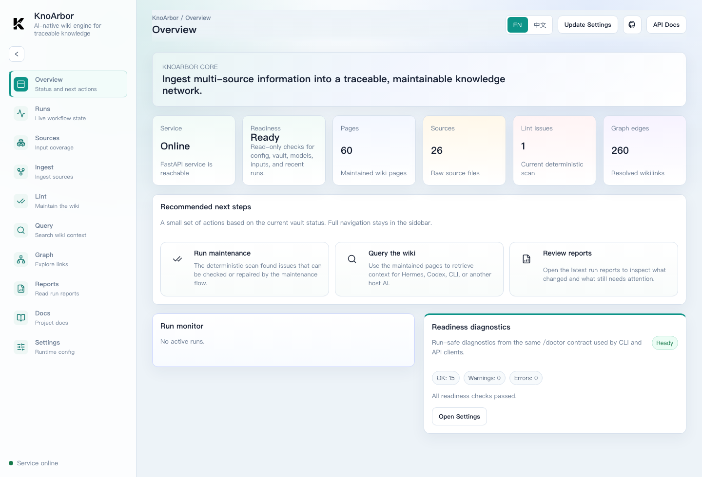
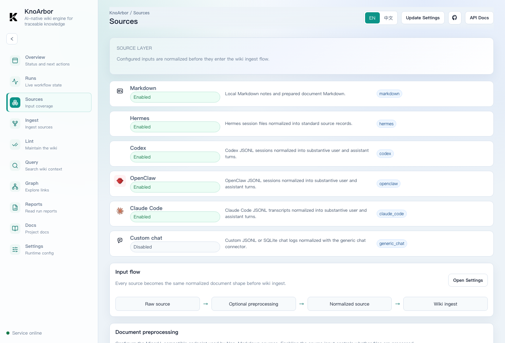
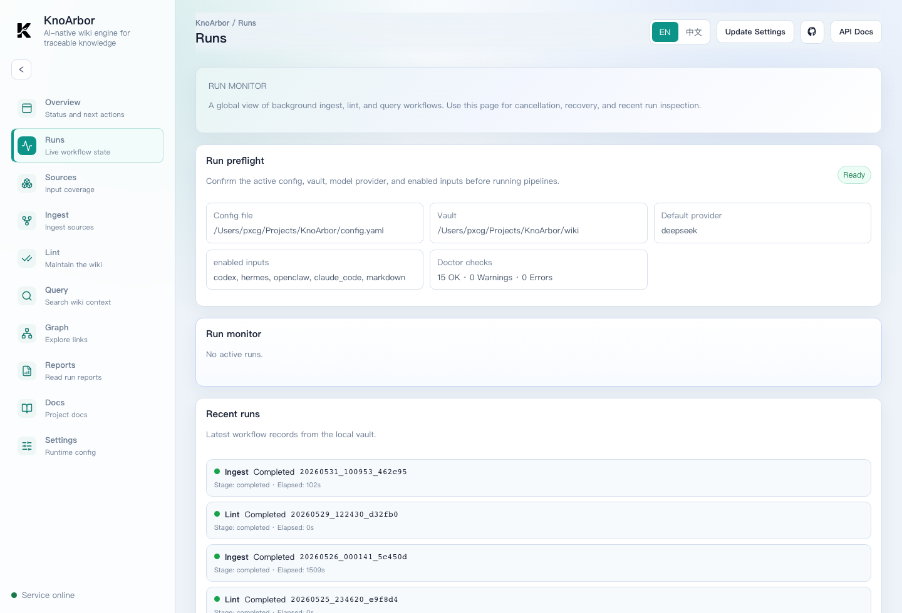
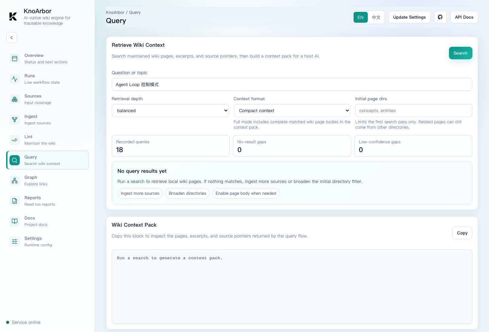
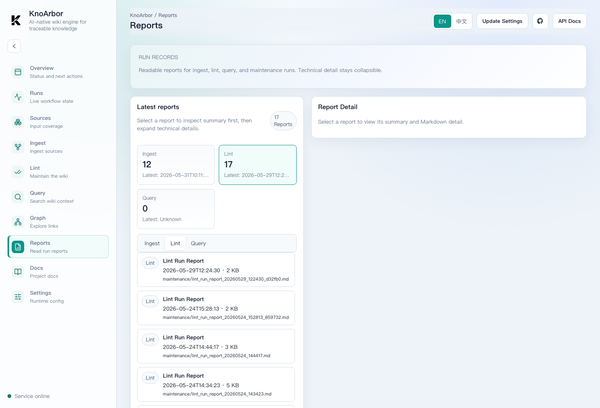
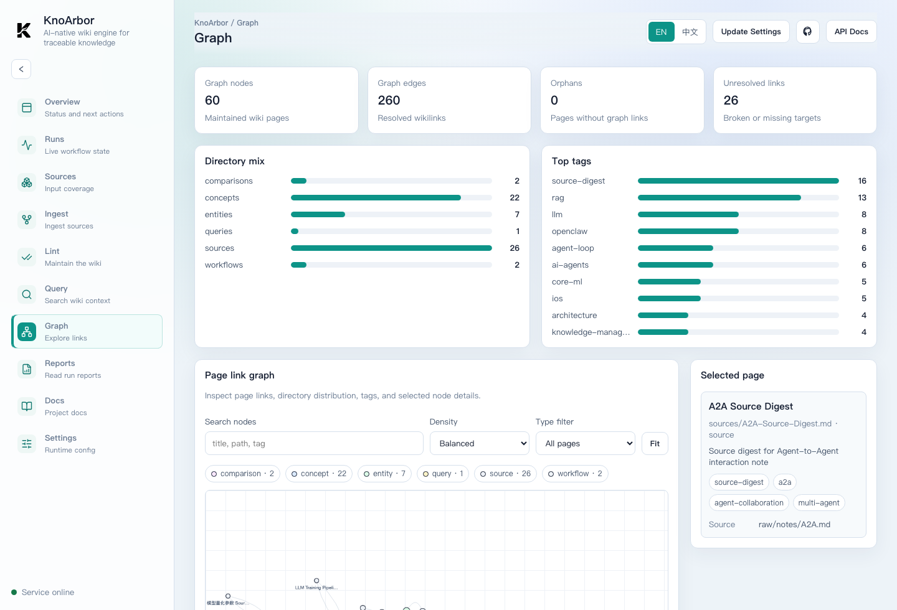

# Showcase

KnoArbor turns multi-source notes, AI sessions, and parsed documents into a local Markdown wiki that can be inspected, maintained, and queried by other AI tools.

It is designed as a knowledge engine, not a chat replacement:

```text
Sources -> Ingest -> Maintained wiki -> Lint -> Query context -> Host AI
```

## Product Snapshot

The local console provides a single place to inspect readiness, run workflows, browse reports, and explore page relationships.

### Overview



Check service readiness, vault health, page counts, and recommended next steps before starting a workflow.

### Source Coverage



Inspect enabled source connectors and understand how raw inputs enter the shared ingest pipeline.

### Run Monitor



Follow long-running ingest, lint, and query workflows with queue state, heartbeats, cancellation, and recent run records.

### Knowledge Base Browser


Browse generated wiki pages, inspect frontmatter metadata, outgoing links, backlinks, and open workflow artifacts without leaving the console.

### Query Context



Retrieve wiki pages, excerpts, source pointers, and a context pack for a host AI.

### Reports And Graph



Read human-friendly run reports.



Inspect the generated knowledge network.

## What It Builds

KnoArbor writes normal Markdown pages into a local vault:

- `raw/`: immutable copied or normalized source material.
- `sources/`: source digest pages that explain what each source contributes.
- `entities/`: named tools, people, products, organizations, projects, and places.
- `concepts/`: reusable ideas, patterns, architectures, and principles.
- `comparisons/`, `queries`, `claims`, `timelines`, and `workflows`: more specialized knowledge objects.
- `maintenance/`: run reports, ledgers, checkpoints, and audit records.

The result is a traceable knowledge network: generated pages link to source digests, source digests point back to raw sources, and query returns evidence that a host AI can use.

## End-To-End Flow

### 1. Connect Sources

KnoArbor currently supports:

- Markdown notes.
- Codex JSONL sessions.
- Hermes sessions.
- OpenClaw sessions.
- Claude Code transcripts.
- Generic local chat JSONL or SQLite transcripts.
- Non-Markdown files through a user-configured MinerU-compatible preprocessor.

Connectors only normalize inputs into `SourceDocument`. They do not decide page types or write the wiki.

### 2. Ingest Knowledge

Ingest segments long sources, extracts stable knowledge, plans page operations, drafts pages, reviews them, writes approved pages, and records a report.

This keeps long chat logs and large documents from becoming one oversized page.

### 3. Maintain The Wiki

Lint scans structure, links, source provenance, graph health, and quality candidates. It can apply approved deterministic and semantic maintenance operations while preserving reports and verification results.

### 4. Query From Host AI Tools

Query returns ranked pages, excerpts, related context, source pointers, trace data, and a context pack. KnoArbor does not generate the final chat answer; tools such as Codex, Hermes, OpenClaw, Claude Code, or a local CLI can decide how to use the returned evidence.

## Why This Is Different From Plain RAG

Plain RAG often retrieves raw chunks at answer time. KnoArbor compiles durable wiki pages before query time.

| Dimension | Plain RAG | KnoArbor |
| --- | --- | --- |
| Main artifact | Chunk index | Maintained Markdown wiki |
| Source handling | Search raw chunks | Preserve raw sources and source digests |
| Knowledge shape | Query-time snippets | Stable pages with links and page types |
| Maintenance | Usually implicit | Explicit lint, reports, and verification |
| Human inspectability | Depends on app | Open the vault in editor or Obsidian |

RAG can still be useful later as a retrieval backend. KnoArbor's first goal is to make the knowledge itself inspectable and maintainable.

## What To Show In A Demo

For a short demo, use the built-in Agent Loop example:

```bash
uv run knoar init --vault ./wiki
mkdir -p wiki/raw/notes
cp examples/agent-loop.md wiki/raw/notes/agent-loop.md
uv run knoar ingest --connector markdown --write
uv run knoar lint-run --mode structural
uv run knoar query "Agent Loop 是什么？"
uv run knoar serve
```

Then open:

```text
http://127.0.0.1:8000
```

Recommended screens to show:

- Overview: readiness and recommended next steps.
- Sources: enabled input coverage.
- Runs: live workflow state and heartbeat.
- Reports: readable ingest/lint/query reports.
- Graph: wiki page relationships.
- Query: returned evidence and context pack.

## Current Boundaries

KnoArbor currently focuses on local-first, single-user operation:

- It does not provide hosted SaaS deployment.
- It does not require a database.
- It does not bundle MinerU or document parsing model weights.
- It does not replace the final answer generation of host AI tools.
- It does not require vector search for small personal vaults.

These constraints keep the first public version understandable, reproducible, and easy to run on a personal machine.
