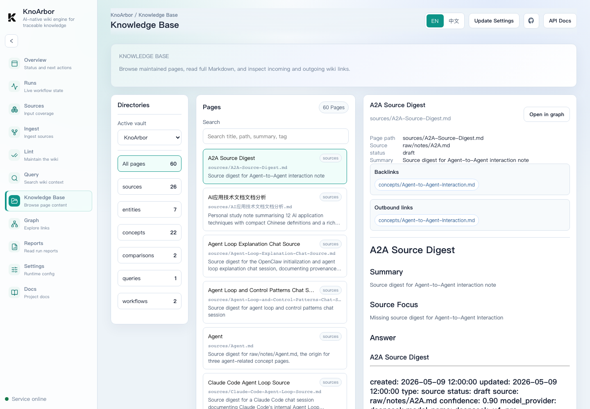

# KnoArbor v0.7.0

KnoArbor v0.7.0 focuses on the local management console and the knowledge browsing experience. It keeps the same local-first architecture while making run outputs easier to inspect: generated pages, lint changes, reports, and the wiki graph are now connected through the UI.

## Highlights

### Knowledge Base Browser

The console now includes a dedicated Knowledge Base page for browsing generated Markdown pages. It shows page metadata, source evidence, summaries, outbound links, backlinks, and page content without requiring users to switch to the filesystem or Obsidian first.



### Run Results Are Easier To Inspect

Ingest and lint report artifacts now connect back to the pages they wrote or modified. Ingest results can expand generated page content inline, and lint results can display page-level changes with readable diffs.

### UI Navigation And Report Polish

The management console has been refined around the main product flow:

```text
Sources -> Ingest -> Lint -> Query -> Knowledge Base -> Graph -> Reports
```

The release improves sidebar ordering, report labels, page links, Markdown preview layout, diff overflow handling, and knowledge-page navigation.

### Failure Reports

Failed ingest, lint, and query runs now write failure reports. This keeps failed workflows observable and gives users a place to inspect the error code, message, run stage, and context.

### Public Documentation Cleanup

Internal maintainer planning documents and capability-map notes have been removed from the public documentation tree. Public documentation now focuses on usage, architecture, API, configuration, concepts, provenance, development, security, and release notes.

## Architecture Notes

v0.7.0 preserves the core Python architecture:

- connectors normalize inputs into source documents;
- ingest compiles source documents into wiki pages;
- lint maintains structure, links, provenance, and quality candidates;
- query returns bounded context packs for host AI tools;
- the management console calls stable local APIs and does not own workflow logic.

The Knowledge Base UI reads from the same wiki page service used by graph and report views, so it is a presentation layer over the file-based vault rather than a separate storage system.

## Upgrade Notes

- No configuration migration is required from v0.6.0.
- Restart `uv run knoar serve` after upgrading so the bundled UI assets are refreshed.
- Runtime vault data remains ignored by git. Do not commit `vaults/`, `.env`, or `config.yaml`.

## Validation

The release was prepared with:

- frontend production build;
- targeted Python tests for lint maintenance, operation execution, and failure reports;
- public documentation scan for removed internal maintainer references.

## Known Boundaries

- KnoArbor remains local-first and single-user in this alpha line.
- It does not bundle MinerU or document parsing model weights.
- Query remains retrieval-only; host AI tools generate the final answer.
